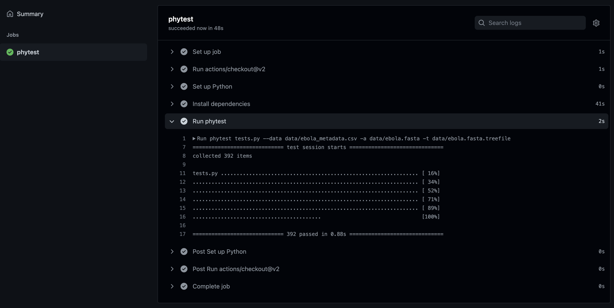

# Continuous testing with Phytest

[](https://github.com/phytest-devs/phytest-continuous-testing-example/actions/workflows/CI.yaml)

In this example we use [phytest](https://github.com/phytest-devs/phytest) to test data shared on GitHub every time it changes. We can run tests against our data using the Continuous integration (CI) features that are freely available through GitHub. Continuous integration (CI) is the practice of automating the integration of code changes from multiple contributors into a single software project. Using github actions we will ensure that anytime our data changes (common during development) that tests will be run against our data.


## Dataset 

We are using a dataset of sequence from the [2014 ebola virus outbreak](). During an ongoing outbreak we would expect out dataset to change rapidly as new sequence become available. 

## Tests

To ensure that we are sharing the correct data in our repository we have two simple tests to ensure our sequence alignment, tree, and metadata files are all congruent. 

```Python
from phytest import Sequence, Tree, DataFrame

def test_sequences_in_metadata(sequence: Sequence, data: DataFrame):
    # ensure all sequences are in the metadata
    data.assert_contains('ID', sequence.id)

def test_sequences_in_tree(sequence: Sequence, tree: Tree):
    # ensure all sequences are in the tree
    assert sequence.id in [clade.name.split('_')[0] for clade in tree.get_terminals()]
```

## Actions

[GitHub Actions](https://github.com/features/actions) allow us to configure code to run every time we push to the repository. The actions are configured in YAML files found in the `.github/workflows/` folder. Below we define an action to run phtest. 

```yaml
name: CI

on: [push]

jobs:
  phytest:
    runs-on: ubuntu-latest
    strategy:
      fail-fast: false
    steps:
    - uses: actions/checkout@v2
    - name: Set up Python
      uses: actions/setup-python@v2
      with:
        python-version: '3.10'
    - name: Install dependencies
      run: |
        python -m pip install --upgrade pip
        pip install phytest
    - name: Run phytest
      run: |
        phytest tests.py --data data/ebola_metadata.csv -s data/ebola.fasta -t data/ebola.fasta.treefile
```

Every time we push to the repository our actions will run. We can see the output of the action on the [Actions tab](https://github.com/phytest-devs/phytest-continuous-testing-example/actions) of our repo. We can also create badges to display the status of our actions e.g. [](https://github.com/phytest-devs/phytest-continuous-testing-example/actions/workflows/CI.yaml). If the tests fail we will get an email from GitHub and the badge status will change to failing. 


